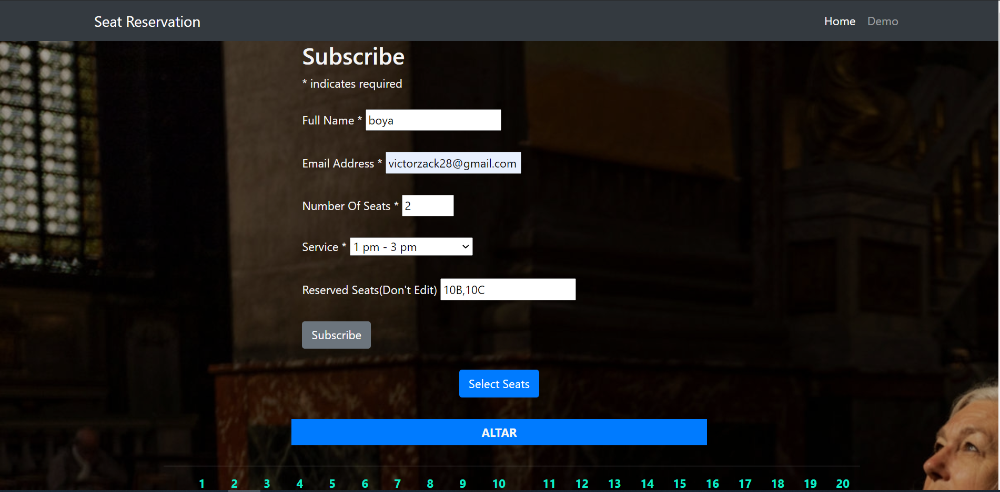

# Seat Reservation
This web application seeks to solve the current problem of missing seats in church due to the restricted number of attendees allowed per service because of covid. The users are able to check and book available seats before coming to church.

### Authors
Edu nush \\
Brian Njogu \\
Ariso Okanga \\
Joseph Ndegwa \\
victor Lominyo \\

## Project Image
 \\

## Setup.
To get a local copy of the site:
`git clone https://github.com/Njogu-Brian/Seat-reservation.git
`Extract` the cloned file.
`cd` to Seat-reservation folder.
*Launch* `index.html` file.

## Technologies used.
* HTML
* CSS
* Javascript
* Bootstrap
* JQuery
* Mailchimp

## Github live link
https://njogu-brian.github.io/Seat-reservation/

## Support and contact details
For any questions and inquiries, contact Brian Njogu via email:
* briannjogu85@gmail.com

## License
[MIT](https://choosealicense.com/licenses/mit/)
Copyright (c) {2020}